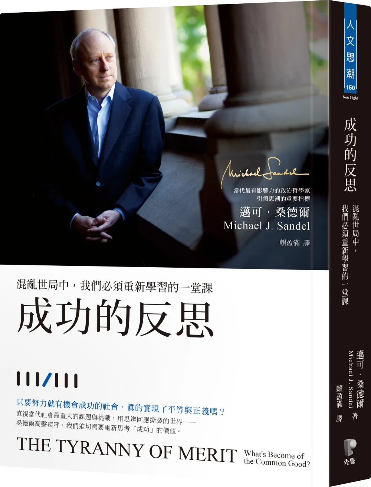

>能力至上主義的暴政

## 能力至上主義帶來甚麼後果

1. 功利主義
2. 從傳統世襲貴族，變成了狗眼看人低的號稱知識份子
3. 知識分子治國，也不代表他們有仁德，賢能的思想來治國。

* 能力不足，造成現在的處境，階級難以流動，是自己的錯
* 能力出眾，賺的盆滿波滿是我應得，獲得獎賞的權威，名譽也是我自己掙得的。

## 勞工和號稱的知識份子愈來愈遠，不再換位思考，不再互相尊重，不再有尊嚴

不再**追求共善，而是你爭我奪**
最終在貿易分工全球化的浪潮造成民粹主義的反撲。

## 但政客沒有意識到問題的本質，並不是他們所想的那麼簡單
歐美國家從這四十年來推崇能力至上主義，想要推翻種族和性別的籓籬，但這只是讓在上層的人變得更加多元而已。  
不平等，及仇恨依然存在且加劇。  
這讓政客有了有所操作的空間  

## 亞洲國家也沒有好到哪裡去。
:::info
外在的能力，才能變成了定義人地位的基礎。這股太超過的才德(能力至上主義)風氣，愈演愈烈到難以收拾的地步。
  
影響到了政界，企業界，金融，乃至於教育，方方面面都被這個思維所過度滲透了。
:::
## 民主變得技術官僚語言化，缺乏公共參與和對話。

> [楊恩](https://en.wikipedia.org/wiki/Michael_Young,_Baron_Young_of_Dartington)講道：
如果人們的價值不是取決於他們的智力、教育水平、職業和權力，
而是他們的仁厚、勇氣、想像力和敏感性，他們的同情心和慷慨。
(也就是回到人的本位，人的初始狀態，不被功利現實所評價)
那麼就不會再有階級……而每個人都將有平等的機會，不是在任何數字的尺度往上爬，
而是去發展自己獨特的能力，過一個豐盛的生活。
>

## 經典名句

> _The meritocratic ideal is not a remedy for inequality; it is a justification of inequality._

:::note 翻譯
💡 最理想化的選賢與能－提供階級和社會向上流動，並不能解決不平等，
只是為不平等找來強而有力藉口。
:::

> For the more we think of ourselves as self-made and self-sufficient, the harder it is to learn gratitude and humility. And without these sentiments, it is hard to care for the common good.

:::note 翻譯
💡 當愈來愈多的人覺得，功成名就是他們自身的功勞，他們不在關心公共利益，
謙遜和感恩將日漸式微。
而共善及共好將難以達成。高高在上的人將脫離現實，民主的公共對話將蕩然無存
:::

> _In a meritocratic society, this means the winners must believe they have earned their success through their own talent and hard work._

:::note 翻譯
💡 在精英能力至上社會，那些站在頂端的人，堅信那些酬勞和名聲他是他們靠自己的能力掙來的，是合理公平分配的。
:::
