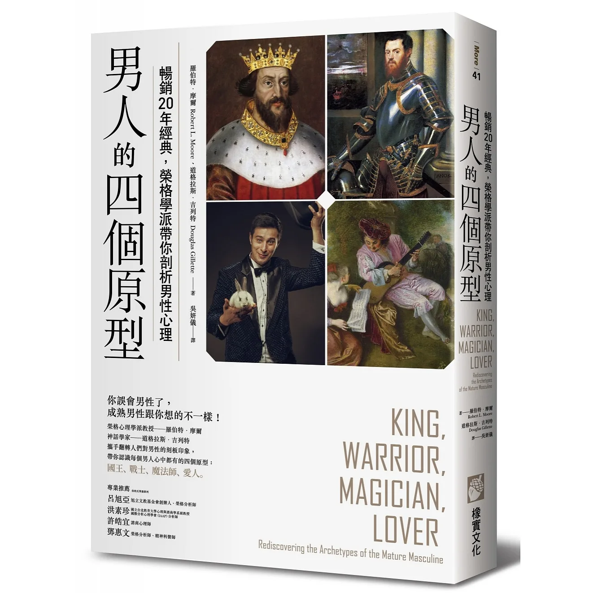

## 英雄的死亡

英雄的「死亡」,是男孩氣質、男孩心態的「死亡」。而且這是男人氣質與男人心態的誕生。英雄的「死亡」在一個男孩(或男人)的生命中 的意義,是他終於遭遇了限制。

他碰上了敵人－自己的黑暗面,那非常不英雄的一面。他曾經對抗惡龍,灼傷:他曾經為革命而戰,然後吞下自身不人道面向的渣滓。他曾經征服 「母親」,然後領悟到他沒有能力愛公主。英雄的「死亡」標示出一個男孩或男人碰上了真正的謙卑。這就是他的英雄意識的盡頭。 

真正的謙卑是由兩種事物組成。

1. 第一個是知道我們的限制。
2. 而第二個是得到我們需要的幫助。

國王、戰士、魔法 師與愛人。道些形式全都互有重疊之處,而且在理想狀態會富彼此。 一個好「國王」同時也會是戰士、魔法師兼愛人。而對於其他三種形式來 說,情況也一樣。 如同我們先前看到的,男孩能量也彼此重疊並互通訊息。神聖小孩自 然地觸發伊底帕斯情結之子。兩者聯合後,形成了某種事物的核心,不管 那是什麼,都將會變得美麗、精力旺盛、與人有連結、溫暖、關愛、有靈 性。男孩的自我需要早熟小孩的覺察力,來幫助它跟那些能量區隔開來。 而这三者全都會導致英出現,英雄讓它們掙脫「女性」無意識的幸制, 並且建立男做為分離個體的身分.英雄讓男孩準備好變成男人。

# 國王 - 太陽

自我是僕人，國王能量和其他能量原型保持恰當距離

為的是更大的共同體利益

> 主能量在所有男中都是最原初的·這个原型跟其他三個成熟男性f氣質潛能之間的關係,就跟神聖小孩和其他三种不成熟男性氣質能量之間 的關保相同.的重要性排名第一,而且在完美的平衡中支持包含其他原型,善良而具有育成力的國王,也是一位好戰士、一位正面的魔法師, 也是很棒的愛人。然而,對大多數人而言,國王却是最後一個出現的。我 們可以說國王就是神聖小孩,但有豐富經驗且複雜、有智慧;在某種意義 上說,神聖小孩有多麼自我中心到以復加,國王就有多無私。
> 

# 戰士

讓人精力充沛、果決、有勇氣，有耐力，堅忍。

:::tip
💡 這個能量需要國王、魔法師、愛人來嗆盪的協助自身連結戰士能量

:::

# 魔法師

:::tip
💡 是深思熟慮和反省的原型

:::

魔法師能量主要是覺察與洞見的原型,但也是任何非直接明顯或非 常識性知識的原型。這種原型掌管心理學裡所謂的「觀察性自我」

自我的恰當角色是退到後面觀察,掃視整 個地平面,監看來自外界與内在兩方面的資,然後從它的智慧之中,根據它對内外在力量的知識,還有它在输送力量方面的技術性能力,再做出輸出

# 愛人

:::tip
💡 人性

:::

愛人是有深刻感官性的;感官上察覺得到物質世界的所有光彩,也對此很敏感。愛人與至體事物有關,也連結到全體事物,他透過自己的敏感性,被吸引到道些事物之中。在敏感性的引導下,他感覺到自己與這些事物之間有同情與同理的聯結。對於連結愛人的男人而言,所有事物都以神秘的方式彼此相擊。就像我們所說的,他「在一粒沙裡見到世界」。

深刻與愛人能量連結的男人,透過這種美學意識體驗到他的工作,還 有跟他一起工作的人。他可以「讀」人如讀書。他通常對他們的情緒變化 敏感到令人難以忍受的地步,而且可以感覺到他們潛藏的動機。這可能確 實是非常痛苦經驗。 所以,愛人不只是人生喜悅的原型。這種與其他人和世界共感的能力

### 連結能量

積極想像對話,是跟這些戴著我們的臉孔,實際上卻不受時間限制的 遍能量形式,實際進行對話、參與董事會、電話會議時一個 在積極想像對話中,我們與這些能量形式交谈,接觸他們中一 或多個,並且提出我們的觀點。然後我們聆聽他們的回答。最好是在紙上 進行這種作業,在自我的思維與感覺,還有「對手」的思維與感受出現 時,把兩者都寫下來,不要加以審查過濾。就像在任何成功的董事會會議 一样,我們至少需要同意彼此有歧異。在敵意非常深的情下,能讓我們需要至少暫時達成一個簡單的和平協議。在最低限度上,這種練 習會幫助我們考量反方的立場,並且盡可能把所有的牌攤在桌上

男人的四個原型包括國王、戰士、魔法師和愛人，而英雄的死亡是指男孩氣質與男孩心態的「死亡」，這是男人氣質與男人心態的誕生，標示出一個男孩或男人碰上了真正的謙卑，並且建立男做為分離個體的身分。國王能量是最原初的，需要其他三種能量原型的幫助，而戰士能量是果斷、有勇氣和耐力，魔法師能量則是覺察和洞見，而愛人能量則是溫暖、關愛和有靈性。

### AI 介紹

榮格的男人的四個原型是國王、戰士、魔法師和愛人，榮格認為，一個男人應該具備這四種原型的特質，才能成為一個完整的人，不僅代表了男性特質，而且也代表了一個完整的人的智慧、勇氣、知識和仁慈。國王應該具有偉大的領導力和決策力，不僅要有能力去解決當前的問題，而且還要積極思考未來對社會的影響，並能堅定地保持自己的原則。戰士應該有著強大的勇氣和毅力，他們應該能夠堅持完成自己的任務，不被外界的干擾而分心，在挫折中保持堅強的毅力。魔法師應該有豐富的智慧和知識，他們不僅需要對世界有足夠的瞭解，而且還要有能力獨立思考，去面對各種挑戰，而不只是僵化地執行他人的指示。最後，愛人應該有著深厚的愛心和仁慈，他們應該有能力去愛護身邊的人，並且能夠做出正確的選擇來保護他們，讓他們感受到關懷和溫暖。

榮格的觀點受到了許多人的歡迎和讚賞，他的想法也被納入了許多文化中，成為不同文化的共同象徵。例如，柏拉圖的理論中提到了兩種人的理想，即“哲學家國王”和“愛人”，這兩種人的特質都融合了榮格的四種原型，讚美他們的完美結合，而許多宗教也提倡榮格的四種原型，以此來指導男性成為一個完整的人，並且理解並尊重彼此的特質，共同追求完美的人生。因此，榮格的四種原型已成為社會中一種共識，深具價值和意義，不僅可以用來溝通，而且也是尋求完美的重要指標。