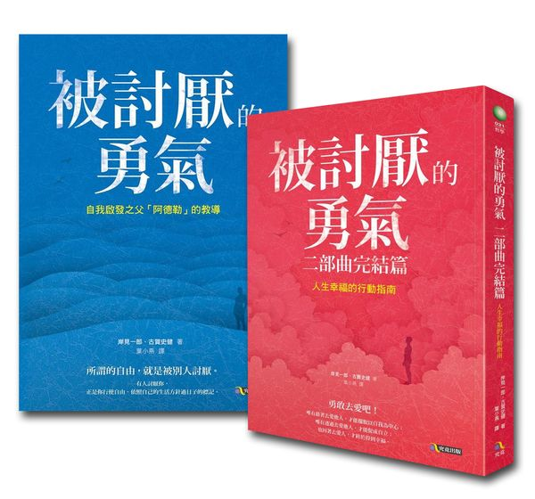

[《被討厭的勇氣》重點心得](https://swacklin.medium.com/被討厭的勇氣-重點心得-ad4f6e2fccf1)

[【閱讀心得】被討厭的勇氣 二部曲完結篇：人生幸福的行動指南 @ 無疆旅者 Borderless Traveler :: 痞客邦 ::](https://borderless.pixnet.net/blog/post/31552132-【閱讀心得】被討厭的勇氣-二部曲完結篇：)

### 自立的定義

:::info
🎩 擺脫以自我為中心，包含對於自我過度的思考及關注

:::

### 教育的實踐目標

和他人發展橫向關係，關注他人所關注(包含以他人視角感受、體驗、看待事物)

尊敬對待每一個個體

#### 尊敬

:::info
🎩 尊敬，即是「如實看待他人」
**「所謂的尊敬，就是對他人可以如實成長發展成他自己的模樣的一種用心觀照」

不試圖改變或操控眼前的他人；不附帶任何條件，如實認同「對方現有的樣貌」。

沒有任何尊敬的方法更勝於此。而且當一個人「現有的樣貌」能獲得他人接受時，應該會因此得到莫大的勇氣。因為所謂的尊敬，也就是「鼓勵（賦予勇氣）」的原點**

:::

#### 課題分離的定義

:::info
🎩 此課題的結果承受人若是他人，自身就不應強硬插手參與。

應在適當距離，讓對方知道，他是可以得到有限度的資源和幫助的

:::info
🎩 但必須由他人來完成

:::

:::

### 同理心的實踐

「要是自己和他擁有同樣的心境與人生的話，會怎樣呢？」

:::info
🎩 「用他人的眼睛去看、用他人的耳朵去聽、用他人的心去感受」

:::

## 保有社會意識 social interest

脫離對自己的執著、對他人付出關心

:::info
🎩 就是對「他人在意的事」寄予關注。

:::

## 改變的勇氣

### 為何無法改變，該怎麼做?

明辨自己和他人的言行舉止，去思考潛藏在背後的「目的」。

:::info
🎩 人，是可以不斷改變的個體，擁有嶄新的自己。

但這意味著死亡，**放棄現在的自己
即便現在有很多不完好，有很多痛苦**

> 因此我們會覺得，就保持這樣就好，
為現在的痛苦找出肯定自己的說詞
> 
:::

## 肯定過去和現在

:::info
🎩 為了肯定「現在」，所以也要肯定不幸的「過去」

:::

## 三角柱

- 可憐的我
- 可惡的他
- 今後**該怎麼辦**

:::info
🎩 **去改變可以改變的東西**

:::

## 脫序行為的五個階段

:::info
🎩 特別的我 — 引人注目

為了【**歸屬感**】

:::

1. 尋求稱讚
    1. 為了在共同體之中取得具有特權的地位
    2. 若得不到稱讚，會像漏風的氣球、車沒了汽油。
2. 引起注意
    1. 即使得不到稱讚也無所謂，總之引人注目就對了
        1. 消極 — 無能，低落，丟三落四
        2. 積極 — 調皮搗蛋
3. 權力鬥爭
    1. 反抗
    
    :::info
    🎩 人，不斷挑釁、挑起戰爭。藉由戰鬥中的勝利來誇耀自己的「力量」
    
    :::
    
4. 復仇
    1. 藉由憎惡，怨恨的情緒中，引起關注
    2. 一再重複對方討厭、害怕的事
5. 證明自己無能
    1. 以不可能辦到，放棄，來逃避課題
    2. 用盡各種方法和手段來「證明」自己有多無能

## 想要得到，必先學會給與

## 自立

愛就是從「我」解放出來

擺脫以自我為中心

擺脫~~怎麼做才會討人喜愛~~

## 稱讚是一種操控

稱讚是『有能力者給無能力者的評價』，目的是要『操控』

褒獎讚揚會帶來競爭

## 人生的任務

- 工作的關係
- 交友的關係
- 愛的關係

## 信用與信任

- 信任
    - 相信他人的時候，不附加任何條件。就算沒有任何足以讓人相信的依據，也相信他。不考慮擔保的問題，無條件相信。那就是「信任」。不是相信對方擁有的「條件」，而是相信「對方本身」。也可以說，重視的不是物質上的價值，而是個人的價值
- 信用
    - 「信用」就是在附帶條件下相信對方。好比說跟銀行借錢的時候，銀行當然不會無條件把錢借出去。銀行會要求我們提供不動產或是保證人的擔保，再借出與擔保品價值相符的金額。而且，還會加上相當的利息。這樣的態度，不是「因為相信你才借錢給你」，而是「因為相信你提供的擔保有價值，所以借錢給你」。總之，不是相信「那個人」，是相信那個人所擁有的「條件」。

:::info
🎩 要先信任自己，才會信任他人。

:::

### 真正的信任，其實是具有徹底主動的影響力

### 總結

我們唯有藉著去愛他人，才能擺脫以自我為中心； 唯有透過去愛他人，才能促成自立；然後也是愛他人，才終於能發掘出社會意識

真正受到考驗的，是持續走下去的勇氣

---

## AI
這篇文章主要介紹了《被討厭的勇氣》系列的主要內容，包括自立、教育的實踐目標、同理心的實踐、保有社會意識、改變的勇氣等方面。自立的定義是擺脫以自我為中心，包含對於自我過度的思考及關注。教育的實踐目標是和他人發展橫向關係，關注他人所關注，尊敬對待每一個個體。同理心的實踐則是要從他人的角度感受事物，用他人的眼睛去看、用他人的耳朵去聽、用他人的心去感受。保有社會意識則是要關注他人在意的事，而改變的勇氣則需要明辨自己和他人的言行舉止，去思考潛藏在背後的目的。文章還涉及了一些重要概念，如尊敬、課題分離、信用與信任等。

在文章的後半部分，作者強調持續走下去的勇氣才是真正受到考驗的。這需要不斷努力和堅持，而真正的信任則是具有徹底主動的影響力。此外，文章還提到了稱讚是一種操控，褒獎讚揚會帶來競爭的問題，並強調了愛是從「我」解放出來，擺脫以自我為中心的重要性。

除此之外，文章還介紹了脫序行為的五個階段，包括尋求稱讚、引起注意、權力鬥爭、復仇和證明自己無能等。最後，作者提到了人生的任務包括工作的關係、交友的關係和愛的關係。信任則是相信對方本身，而信用則是在附帶條件下相信對方。文章最後總結說，我們唯有藉著去愛他人，才能擺脫以自我為中心，唯有透過去愛他人，才能促成自立，然後也是愛他人，才終於能發掘出社會意識。真正受到考驗的，是持續走下去的勇氣。

總的來說，這篇文章提供了許多有價值的觀點和思考，對於想要成為更好的自己、建立更健康的人際關係的人來說，是非常有啟發性的。這些觀念和概念不僅可以在個人生活中應用，同時也可以應用於職場和社會關係中。通過理解這些概念和實踐，我們可以更好地了解自己和他人，從而建立更健康、更積極的人際關係。

## AI generate
阿德勒思想是一種心理學理論，強調人類的社會性和主觀感受。要在生活中實踐阿德勒思想，可以考慮以下幾點：

1. 建立積極的人際關係：阿德勒強調人際關係對個人健康和幸福的重要性。要建立積極的人際關係，可以主動去認識新人、關心他人的需要、給予支持和鼓勵，並且避免競爭和攻擊性的行為。
2. 培養社會利他心理：阿德勒認為，人類本性中具有社會利他的傾向，通過關注他人的需要和幫助他人可以滿足個人的心理需求。可以通過做義工、參加公益活動、幫助身邊的人等方式培養社會利他心理。
3. 面對挑戰時採取積極樂觀態度：阿德勒主張人們應該以積極的態度面對生活中的挑戰，相信自己可以克服困難，並從挫折中學習。在生活中，可以通過改變負面的自我認知、轉移注意力、設定具體的目標、尋求支持和鼓勵等方式，培養積極的樂觀態度。
4. 培養自我責任心：阿德勒認為個人可以通過自我責任來掌控自己的生活，避免把問題歸咎於外部因素。可以通過制定計劃、設定目標、自我監督和自我評價等方式培養自我責任心。
5. 尊重他人的主觀感受：阿德勒認為個人的行為和態度受到自身主觀感受的影響，因此應該尊重他人的主觀感受。在與他人交往時，可以通過主動傾聽、理解對方的情感和需求、尊重對方的決定等方式來展現尊重他人主觀感受的態度。
6. 培養自我成長的動機：阿德勒認為人類追求成長和自我實現的動機是至關重要的。要培養這種動機，可以關注自己的興趣和嗜好，為自己設定挑戰性的目標，並且尋找有助於自己成長的經驗和機會。
7. 培養正確的生活態度：阿德勒認為個人的生活態度會影響他們的思想和行為。要培養正確的生活態度，可以關注自己的身體健康，維持積極的情緒狀態，發掘自己的價值和意義，並且保持開放和寬容的態度。
8. 掌握有效的溝通技巧：阿德勒認為溝通是維持人際關係的重要因素。要掌握有效的溝通技巧，可以學習如何表達自己的意見和需求，如何聆聽他人的意見和需求，如何處理衝突和不同意見，並且如何建立共識和協作。
9. 珍惜時間和資源：阿德勒認為個人的時間和資源是有限的，需要珍惜和有效利用。要實踐這一理念，可以學習如何管理時間和資源，如何優先處理重要和緊急的事務，如何避免浪費時間和資源，並且如何保持高效率和生產力。
10. 持續學習和成長：阿德勒認為個人的學習和成長是持續不斷的過程。要實踐這一理念，可以不斷學習新知識和技能，關注社會和文化的變化，尋求專業和個人發展的機會，並且適應和創造新的環境和機會。

以上這些是阿德勒心理學的實踐方法，透過這些方法，我們可以培養出社會感，建立更好的人際關係，培養社會利他心理，面對挑戰時採取積極樂觀態度，掌握有效的溝通技巧，珍惜時間和資源，持續學習和成長，從而實現自我實現和幸福感。