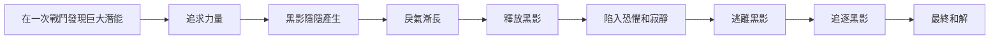

[潛意識、象徵、夢 -淺談榮格心理學｜方格子 vocus](https://vocus.cc/article/5f7e90d3fd897800016c21c6)

[《地海巫師》心得—探索本質的成長詩篇｜方格子 vocus](https://vocus.cc/article/62cd1800fd8978000180e530)

[跟著格得尋回自我：從地海巫師談面對陰影 - 幽樹的療癒客棧](https://yukiiheal.com/跟著格得尋回自我：從-地海巫師-談面對陰影/)

:::tip 金句
🐣 寂靜中創造箴言。

黑暗中湧現光明。

面向死亡得再生。

鷹揚虛空，燦兮明兮

:::

這是一個男孩從12歲20歲的成長經驗。  
我在這一本書得到非常大的共鳴，我和格得曾有過相似的經驗。  
前一陣子步入了夢境的迷霧，踏入了精神分析的領域，我在這本書獲得了一些勇氣和方法度過了那個天天作夢的日子。  

這是我第三次看完地海巫師

我特愛他直面內心的勇氣，作者用具象化的方式描寫人回到內心的過程。

他不知道距離，也沒有明確的目的地。

我在利用這一本書，作為指南

在我的內在尋找力量

## 蘊藏的思想

### 一體至衡

追求力量，而沒有相應的智慧與之相配，會招致反撲。

第一個

### 老莊思想 + 榮格心理學

:::tip 金句
🐣 若一個人的力量是一座泉水，耗用的速度比補充的速度還快，最終會導致乾涸。

不過度取用 — 老莊思想

:::

:::tip 金句
🐣 大化平衡

萬物形意

:::

## 故事脈絡 - 這是關於痛苦與成長

### 天才之路的起頭

他是個天才，從小就是力量強大的孩子。他人生中的啟蒙者就是地方女巫，女巫教導了他許多事務的真名，讓他有了渴望，有了統御的力量。

它的內在力量也很強大，學任何事物都很快速。

這一個小孩子，在外人入侵時，力量和知識獲得絕對的展現，他召喚迷霧，將敵人重重圍起，最終用計擊退，但他也把自己的能量耗盡了。

:::tip 金句
🐣 若一個人的力量是一座泉水，耗用的速度比補充的速度還快，最終會導致乾涸。

不過度取用 — 老莊思想

:::

> 他急於證明自己的內在力量，急於想要取得高於他人的統馭力。
> 

### 遇見恩師

緘默者歐吉安，來到床前，輕碰了內力耗盡，眼神呆滯的達尼，恢復了意識，
他話不多，卻字字珠璣，話出自成箴言，他不是普通人，但他深知「言」所蘊含的力，而小達尼卻還沒有操縱力的道及智慧。

他將要13歲，將舉行成年禮被授予箴言，然後開始他的修煉之旅。

#### 成年禮

成年禮如同古老部落會舉行的成年禮一般，具有儀式感，必經先經歷苦痛，讓過去死亡，讓男人新生。

這在榮格的思想裡也常談到儀式的重要性。

他被授予了真名「格得」這是長大的新名字，毆吉安授予他的。

他開始了他的旅程，離開了他的家鄉和熟悉的人們。

他13歲。

### 開始修練

歐吉安甚麼都沒有傳授他，施展法力必須要知道事物的真名，才得以操控，而歐吉安總不發一語。

但他的教導早就已經開始了。

他很急，也不明白，他覺得它甚麼都沒有學到

施展法術必需耐心，而他也已經從他的泉源汲取過多力量。

他們觀察道，路邊的花草，格得，這位13歲的學徒，問到這草的用途是甚麼 ?

但歐吉安答到：了解它的本質，就得以得知它的真名，這比它的用途都重要。

他對這個還懵懵懂懂的學徒提出深刻的對於生命的叩問：
「你的用途是甚麼？我的用途是甚麼？山有用，還是海更值?」

:::tip 金句
🐣 過了半哩，歐吉安說道

要聆聽必先靜默。

:::

歐吉安見雨來了，任憑著雨浸濕身子，他覺得在他身邊學不到東西。他渴望力量。

而空有力量不使用又有而用？

#### 這場修練一開始，就是從平凡的生活中悟道

歐吉安極為沉靜，沉默經常充斥著每一天。

趕趕羊群，或是採集草藥。

---

但是蠱惑人心的女巫來挑動格得不安定的內心。

利用他的好勝心，激起他想嘗試高深技力的慾望。

像是召喚死人，變換身形。一個打破平衡，一個讓自己遺失自我。

害怕肯定是有的，但好勝幾乎佔據了他的心，在他還不成熟的心智接觸這些，放出了他在心中的黑影。

---

歐吉安講道：

「危險必然環繞於力量，黑影必然環繞於光亮。」

歐吉安並沒有依定要留著他，他知道格得必然前方得面對黑暗。

但他還是讓格得去巫師之島－柔克島

### 柔克讓他的力量突飛猛進，但危險伴隨著力量膨脹

#### 航行

他搭上「黑影」這艘船，前往柔克學習法術。

這時格得15歲，第一次踏上船，第一次出海，開始學習人情世故。

他和大家學習船上的工作，接受周圍年紀相仿男孩的揶揄和稱讚，但他應對的很好，因此人緣不錯

他們愛嘲弄人，但其實本意是友善的。

#### 到達柔克島

接待他的是賈似柏，賈似柏一開始並無惡意，但是對於格得來說，這位富家子弟的行為舉止像是在嘲弄他。

他兩結下了梁子，而這結愈來愈緊。

但他還認識了一位摯友，在他面對黑影還會與他上山下海共患難的朋友－費渠

他有一種強大穩定的魔法，叫做友善，他為這一段關係提供了強而有力的基礎，確定且自由開放的關係。

但黑影隨著忌妒、怨恨、憤怒、奚落、嘲弄，而挑動，漸漸滋長

他渴望力量，而這會將他推入深淵。

---

他的確比任何人學的都還要快速，他很快就掌握了高深的技法，包括召喚死人。

:::tip 金句
🐣 在柔克的法師們叫面對格得時

向歐吉安依樣，和格得講道了 一體至衡的重要性

變換物體本質，必將影響平衡，要謹慎使用。

:::

他受不了賈似柏的激將，他的怒火，忌妒憎恨，沖昏了他的理智
他的情緒佔上風，

他施起法術，念念有詞，在明月光夏的柔克山丘，遙向海面，這裡是天地回應法術最強的地域。

風起雲湧，唱誦起真名，霎時間，過去的人真的被喚起了，神情哀戚，但下一秒，土地和黑夜間產出一到巨大的裂痕，在巨大的亮光中爬出一個怪物，是從格得身上分離的。

爬上他的身子，他們在地上彼此糾纏，格得也被黑影怪在臉上打出深深的傷痕。

直到大法師前來，油盡燈枯的他用盡自己所有氣力，將格得發回現世，一命抵一命，大法師因氣力耗盡離逝，他自己也因為被怪物所傷苟延殘喘。

他剛剛把世界撕裂開了，他也把自己給撕裂了。 

漫長的，冰冷的療傷就此到來。

他眼瞎，耳聾，口啞…甚至一開始高燒不退，黑血湽湽劉的不停，傷口撕裂不齊

他所有的自信傲慢、戾氣被打碎。

他僅剩有虛弱不堪的軀體，還有哀戚的神情，懼怕冰冷的心靈。

#### 17 歲

他再回到學校從新學習，他已經落後同儕許多，學習速度也不如以前快速。

他的好友費渠，已經被授予巫師杖，在今晚到格得的房間與他告別。

臨走前，費渠告訴格得他的真名：艾斯洛特。

真名代表一個人的一切，這就相當於對一個人交付真心，以及確立這任信任不可動搖。

他也回報：我叫格得。

這一晚他滿17歲，他回憶了過去所發生的一切，4年前，他被毆吉安授予真名。

4年高潮到跌宕起伏，破碎。

他對於自己有較深的體認，然而他的未來摸不著，他也畏懼一見。

恐懼將伴隨他好久好久，直到他轉過身。

---

他花了好長一段時間，嘗試去明白他所釋放出來的黑影，但很少有知識或書籍記載這種存在，能言者也不知道這形物的真名。

召喚師傅經常在格得生病時來陪伴他，他曾告知格得。

他是循著格得的聲音，靠著格得內在的力量召喚出來的，他有一天一定會明白他的本質。

法師並不是無所不能，一個人的智慧知識增長到一個高度，他能夠選擇的反而變窄，到最後他甚麼也不挑揀，全心去從事他必須做的事情。

> 認知自己的侷限和力量，接受生命的感召，作為一個僕人，一生為靈魂和更大的共同體服務。
> 

### 18歲 巫師

他在這一年完成修習，成為了一位巫師，並被授予巫杖。

經過了這些年他已經沒了傲氣，甚至會懷疑自己的氣力。

他出了柔克的第一關，除了面對自己的心魔，就是面對龍。

替他第一個服務的地域－下托寧

這裡的居民害怕龍來侵害，因此向柔克請求一巫師，

無名無利，但他還是選擇去了。

他並不打算久留，因此直搗龍窟。

狡詐為利的龍想用黑影的真名來誘惑格得，但格得抵扛住了誘惑，並運用智慧得知了龍的真名。

當真名被詠唱，被喚響，就像燒的火紅的鐵線，緊緊勒住老龍的脖子，要牠以自己的真名啟誓

永遠不要騷擾人類居住的群島區。

---

在這島上的生活中，他沒能救回一個孩子的性命，在靈魂的追逐中，他曾遇到了黑影，招喚了光明。

在鬼門關走一遭，雖然有消耗氣力，但在他的朋友－小甌塔客，的幫助下還算是全身而退，也對自己多了一些信心。

牠用牠的舌頭，舔牠的手腕，太陽穴，他的疤痕，和他緊閉的雙眼，這朋友用他的力量，將格得從無意識中喚回，他也開始去體會歐吉安在巫師之途剛起程時，帶他每日遊覽森林，去體會每一個生命，去靠近每一個生命，無論會動或矗立恆久，無論有沒有語言，他都保持沉靜，去看動物的雙眼乃至於樹木枝芽的搖曳。他終於開始能更進入去微觀本質。

### 被追

屠龍成功後，告知完島民感受完人情冷暖，格得便想前往柔克島向大師請益對抗黑影的解方。

因為一旦黑影在格得衰弱的情況下逮住他，佔有他的軀體及力量，取代他的心智，那必定危害人間。

想到這他就非常懼怕。

但柔克島的風，將所有邪惡阻擋在外，他得知，黑影不遠了。但他不得其門而入。

---

他開始隨著機運流浪，也開始逃跑。

#### 鐵若能宮 - 引誘

他被引誘到歐司可島，在那裏他遇見了一個侵占人類軀殼的尸偶，是他的黑影，但他沒有發現，雖然他內心帶著疲累與恐懼，他最終還是被引誘來此，這裡的島民，船隻，遠不及他在其他島嶼的人民那麼親近，商人們僱用奴隸划槳，他們沒有自由，無論階級，各個眼神兇狠，用金幣交易，人與人之間沒有友誼。

下船後那個尸偶尚可使用軀體的聲帶發出人類聲音，帶領格得前往鐵若能宮，他們走得愈遠，雪地也積得愈厚，他也愈發疲累，意志和感官不再保持警覺，他也不曉得土地上誓物的真名，所以有困難也無法喚來幫助。巫師的力量是有侷限的，當他們不了解事物，也就無法請求他們所要的力量前來，或者萬物回應的力道減弱，法術不按照他們的預期運行。

黑影展現了他的真面目，他吞掉了替身的軀體，變成了一團有形的黑影，沒有聲帶，卻用一種恐怖的聲音，喚著格得的名字，他用巫杖攻擊，已然冒著煙的巫杖卻著火，灼傷他的手。

他跑，但最後只是拖著身軀勉強向前，而黑影似乎也難以追上他，黑影對著他低估喃喃。

他終於明白，那細小的聲音一直存在，他難以擺脫。

他逃無可逃，面前是一座牆，隱約有一扇門發著光，尸偶追上他，抓住他的斗篷，他成功進了門，但昏去。

---

#### 引誘

他躺在一個床上，這個房間似乎一直都很冷，應該說，整個宮殿都很寒冷，是一種即便穿暖，蓋厚被子，那種寒徹骨，冰霜至心扉的感覺似乎無法消退。而且他的歐塔客在外頭因為打鬥逃跑而去世。

這裡也不是甚麼好地方。

這裡的夫人好心好意提供處所，卻想引誘他接觸太古力石，想要格得與它說話。

這一塊鐵若能石用高超的髮處綑綁，講理頭的精靈封印住，但依然有很強大的力量流瀉而出。封印室陰冷，進去的格得幾乎無法說話，多待一秒都覺得難受

她不斷引誘格得，告訴格得鐵若能石會告訴他對付黑影的辦法。

但實際上，太古石覬覦格得的力量和軀體，它想在格得被黑影侵占前先先發制人。

夫人使用權力來誘惑格德，並表明，獲取這種力量不需要任何代價，格德具有強大的技與力，能夠駕馭這股力量，即便格德表明他已經在放出黑影時斷送這股力量了，但夫人依然表明格德能夠獲取更強大的力量，他能夠成為鐵若能石的主宰。

但他此時意識清醒：太古力並不是要供我們使用的，這股力量到我們手上只會招致毀滅與破壞。他不是被吸引而來，而是被黑影驅趕而來。他想知道黑影的名字。

夫人講道：唯有黑影能對抗黑影，黑暗能對抗黑暗，那塊太古力石，知道生與死，知道末生與來世，他會像個奴隸服從你，服效於你的力量並為你所用，而我會與你一起統治一切。

驅散黑暗的是光明，格得講道。

他差一點就要拖進邪惡裡了，還好，他尚未允諾，所以力量無法操控他。

如果他早早就經不起誘惑摸了太古石，他早就迷失自己了。

---

天搖地動，城主喚出了鐵若能城的守衛，他和夫人逃出城堡外，看到他死去的歐塔克，憤怒，仇恨湧上心頭，他被欺騙才至於此，他被蠱惑，而差一些將靈魂賣給黑暗。

夫人藉著這股怨氣，叫他趕緊變身，這是變形術，一種使用過度會迷失自己本質的法術，他變成了一隻灰色海鷗，和太古力的飛鳥守衛戰鬥，他邊戰邊逃，又變成大老鷹飛向遠方，他憤恨，心裡頓時五味雜陳，那是一種所有的悔恨，所有的悲痛，所有的怨氣，也有著鳥的狂野，他離開，也漸漸忘著自己是誰，只有飢餓，風向和航行目的地。

他成功飛離了危險冰冷的島嶼，飛離了欺騙和蠱惑，飛離了黑影，但也漸漸忘了自己的意圖。他想回家。

變形意味著拋棄自我，遠離事物的真相，有許多法師喜歡變成海豚在海裡優游，他們的意志也成了海豚的意志，也就再也回不去了。

他到了緘默者歐吉安的住所，他無法變回人形，歐吉安用雙手編織法術，並叫喚真名「格德」，一個全身發抖，雙眼疲倦呆滯的年輕人，卻身軀駝背。

他休息了好多天，才得以說話。

歐吉安對格德說道：你必須轉身，回頭，去追尋你的黑影：
「我在阿耳河的泉源為你命名，那條溪流由山上流入大海」

「一個人終有一天會知道他所前往的終點，但他如果不轉身，不回到起點，不把起點放入自己的存在之中，就不可能知道終點。假如他不想當一截流中心水翻滾淹沒的樹枝，他就要變成溪流本身，完完整整的溪流，從源頭到大海。」

「格得，你返回弓忒－家鄉，回來找我；現在你必須更徹底轉身，去尋找源頭，去尋找源頭之前的起點，那裏蘊含你獲得力量的希望」

談話良久，格德跪下，道出他在巫師之島嶼偉大的巫師同行，但歐吉安才是他真正的師傅。

歐吉安出了門，帶回一根出操的紫杉木，歷經修剪編咒，修掉瑕疵。

重新授予格德一支巫杖，這又是一次久別，歐吉安把他的祝福全不注入這支巫杖，伴著格得前往更遙遠的地方，這對於他們兩個都意義重大。

歐吉安向來不勉強他人留下，他的愛，是祝福與成全，讓他走上自己的找自我的道路，使他成為完人。

### 追 - 面對自己的黑影

他又開啟了漫長的航程，即便巫師在地海備受禮遇，遇到的人不一定都是友善好客的，他是個旅客，在一個地方待不久，又走，疲憊和海風在他的臉龐多了幾分沉穩和滄桑，他不得安眠，因為船不一定是穩固的，若不持續更新魔法，船隻會支離破碎。

途中在海上多次遇到黑影，但黑影有著幾分恐懼，因為格得正面面對它，它成了被追的

它跑，但格得永遠知道，它很靠近了。幾次交手後，格得的內心恐懼也漸漸消退了，

他們永遠無法脫離對方，這是牢不可破的命運鎖鏈，格得勢必要讓他釋放的，回到他自身。

#### 旅伴

他遇到了他19歲旅程中最棒的旅伴，他的老朋友費渠。

費蕖說甚麼都想和他一起經歷這段旅程，畢竟萬一格得失敗了，還有費蕖能夠善後。

他們不斷遠行到開闊海，途中經歷了許多人，和風雨。

他們離開現世，到了人煙憾至的地方，這裡沒有人類經過，他們在冬季出海，雨水冷澈到骨子裡。在海上不停地打哆嗦。

雖然格得疲憊不堪，但他堅定的意志，讓他維持好幾個小時的法術風，乘風破浪前進。

巨浪滔天覆地，但隨著他們已經來到起頭，霎時間，水面漸漸不再搖擺抖動，船隻也漸漸平穩，即便划槳，也不見船隻前進，好似他們在海平面，中央。

但格得眼之所見，並非費蕖目之所見，格得眼中映出的畫面，費蕖隱約看到格得眼中的黑暗。

幻術漸漸崩解， 周圍的海水被沙子吞噬，格得下海，踏在海上徒步前往。手杖發著溫暖的白光，漸漸遠離船隻，光暈的邊緣，跑出了黑影，黑影變成了他在歐司可島看到的恐怖臉孔，不知是人還是怪獸，格得舉高巫杖，那光亮讓人睜不開眼睛，消融了周圍所有的黑暗，他再往前，人和黑影叫喚彼此的名字「格得!」

他放下巫杖，主動抱住他的影子，他的黑色自我，從此光與暗合而為一。

巫杖的光芒漸弱，費蕖以為格得被打敗了。

他像過去的自己一樣，在黑影初生時一樣，協助格得，或至少與他同生共死，然而一踏出船隻，雙腳即陷入流沙。

霎時間幻象結束，陽光、海水返回現實，不會游泳的費蕖艱難的把格得救起來，眼神似乎有些空洞，呆滯。

筋疲力竭，身體浸濕顫抖，一句話都不說。

他凝視著月亮良久，再度雙手握持巫杖站起，告訴費蕖

「艾斯洛特，我現在完整了，我自由了!」

## 解析及心得

過去我經常去問，我發現，答案就在心中

我在2022年寫給同學的卡片中寫道：願妳到每一個坎，有疑惑，妳都能在自己身上找到解答。

格得的生活從小時的天才，在幾次成功經驗後，傲慢漸漸在心中滋長，力量隨著學習不斷增長，但格德，因為忌妒自傲，害怕與無知…碰觸了禁忌法術，就此陷落。

其實他的剛烈及不諳世事的天真，歐吉安早就預示到他會因此重傷陷落，甚至從尚未去柔克島開始，內心的陰暗面就開始滋長了。

這時歐吉安，順著他，讓他搭乘「黑影」這艘船，前往魔法之島見習。
這艘船也暗示了他要面對的一切。

即便歐吉安隱約知道格德會獲得強大力量，然後沒有相應的智慧去駕馭它，他深邃的眼也許早已預知了這一切，但這位智者還是讓他去了，讓這隻老鷹就此飛去，自由去闖蕩。

而這愛是我為你準備好所需要的一切，望著你的背影前行，而在你受重傷時，他依然在那個地方，為未來經歷寒霜的雀鷹，守候。

自從不當的使用魔法，召喚出亡靈，動搖天地平衡，因而被自己的魔法所傷，黑影就在他的臉上留下深深的傷疤，他幾乎就沒有一天安穩過，他的害怕，侵蝕他的力量，擾亂他的心智，使他的肉體衰弱，讓每一個夜晚，冷澈過筋骨心，夢魘不斷重複，不得好眠，每一天都在和黑影對抗而深深的疲憊 (fight his darkside)，不斷的逃，後來轉而不斷的追，追他的黑影，shadow - part of Self 

追到天涯海角，他的稜角被磨平了，他漸漸安穩，平靜。

剩下的是冷峻又溫暖的目光，從14歲到19歲，但我覺得是14歲到50歲那樣的漫長。

---

他的人生中有許多貴人相助，無論是一面之緣的相助，或啟蒙，或是蠱惑或冷漠。

他的人生大部分時候是孤獨的，因為面對自己的陰影，是一段漫長看不見盡頭的路。

#### 歐吉安

他的愛，就是不綁住，讓格德去受傷，自己去理解，他最後會回到他身邊，然後再離開，他只祝福，給他所需要的，給他心靈的滋養，即便他13歲還不太理解，他用他最好的方式去愛他，並不是佔有，成全更好的他。

#### 費蕖－艾斯洛特

他的友善和耿直，是友情的基礎，他和歐吉安都做了一個恆久的承諾，當你需要時，你可以來找我，費蕖有自己的生活，他也選擇過自己的生活。費蕖給了格得一個最珍貴的禮物，他的真名，這是一生厚重的託付、也是一種承諾，這是一個長遠開放的關係，在格得最需要時，和他一起走過人生最黑暗的一段，沒有目的只有方向的探詢。

在他被黑影攻擊時，即便害怕也會挺身相助，行動是最厚實的言語，這個鎖鏈將他們緊密相連，卻又不至將彼此束縛。

#### 歐塔客 - 侯耶哥

不能言語，卻是格得最棒的的夥伴，他具有靈性，總是有辦法在格得面臨死亡邊緣時，用它的原始智慧，將格得拉回。

我想它也代表一種格得的內在力量，它總是有辦法再將自己拉回本位。

---

---

### 一體至衡 / 接納全然自我

中途肯定會經驗許多考驗，但最終都要面對自己並回到本質，理解本質後，順應本質生長，一切自然會回到平衡。

這是一個男孩從12歲20歲的成長經驗。

我在這一本書得到非常大的共鳴，我和格得曾有過相似的經驗。

前一陣子步入了夢境的迷霧，踏入了精神分析的領域，我在這本書獲得了一些勇氣和方法度過了那個天天作夢，被自己的夢嚇死的日子。

但我試著去解析，去接納，在每一個獨處的時間

> 要聆聽必先靜默
> 

去聽取身體給我的指示，並聽取靈魂告訴我的聲音。

跟隨自己該走的路去走。

靈魂是獨立的。你一生應只為它服務，作為它的僕侍。

格得在自己的意識之海，在意識的底層，遙遠的盡頭，和自己的自我相會。它用了4年和自己和解。

:::tip 金句
🐣 寂靜中創造箴言。

黑暗中湧現光明。

面向死亡得再生。

鷹揚虛空，燦兮明兮

:::

> 拋棄舊有姿態重新轉生。
>