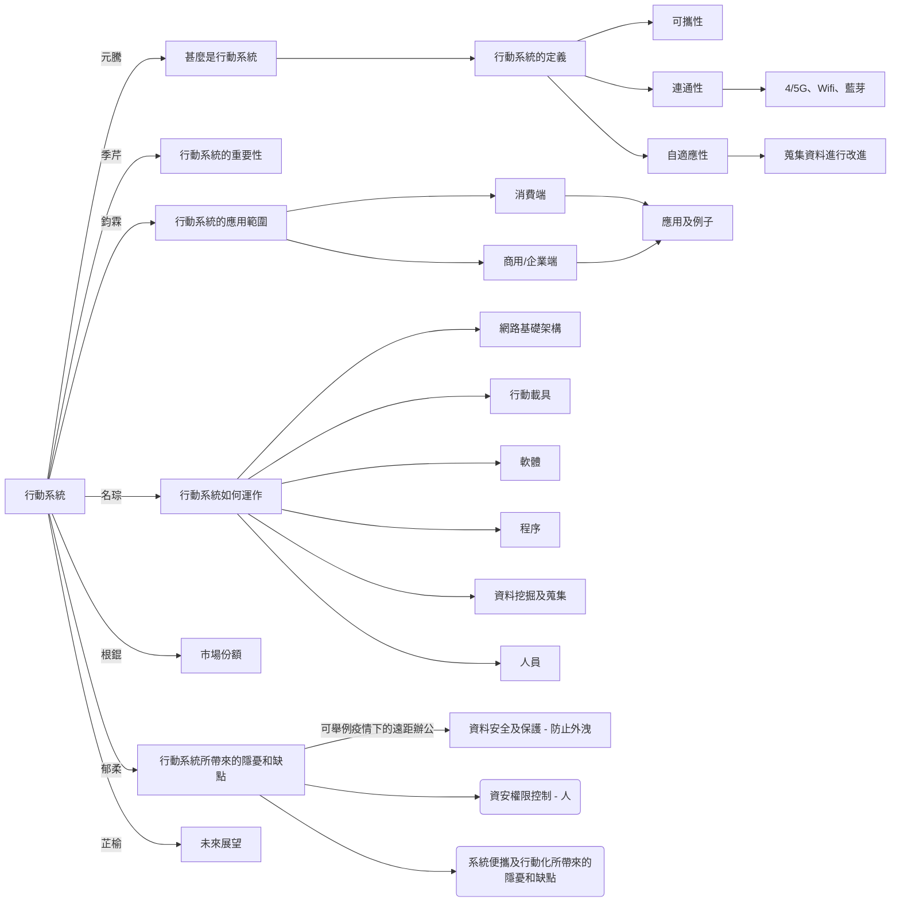

# 行動系統

::::info 
4/14 報告  

:::caution 注意
**3/30 第一次進度確認**  
[**簡報連結**](https://liveyuntechedu-my.sharepoint.com/:p:/g/personal/b11123021_live_yuntech_edu_tw/EWdZ5XfyYm5IqncFxReMgRgB85n1Qa31OQPrWsab4fSr_g?e=3uCMtZ)
## [_**點我下載參考簡報**_](ppt.pptx)
:::

::::

| 人 | 子項 |
|---|---|
| 王鈞霖 | 行動系統的應用範圍 |
| 張元騰 | 什麼是行動系統 |
| 洪名琮 | 行動系統如何運作 |
| 房郁柔 | 行動裝置帶來的隱憂和缺點 |
| 蔡季芹 | 行動系統的重要性 |
| 江芷榆 | 行動系統的未來展望 |
| 王根錕 | 市場份額 |

<iframe
  src="https://liveyuntechedu-my.sharepoint.com/personal/b11123021_live_yuntech_edu_tw/_layouts/15/Doc.aspx?sourcedoc={77e55967-62f2-486e-aa77-05c5178c8118}&action=embedview&wdAr=1.7777777777777777"
  width="100%"
  height="500px"
  frameBorder={0}
>
  這是 &lt;a target="_blank"
  href="https://office.com/webapps"&gt;Office&lt;/a&gt; 提供的內嵌 &lt;a
  target="_blank" href="https://office.com"&gt;Microsoft Office&lt;/a&gt; 簡報。
</iframe>
