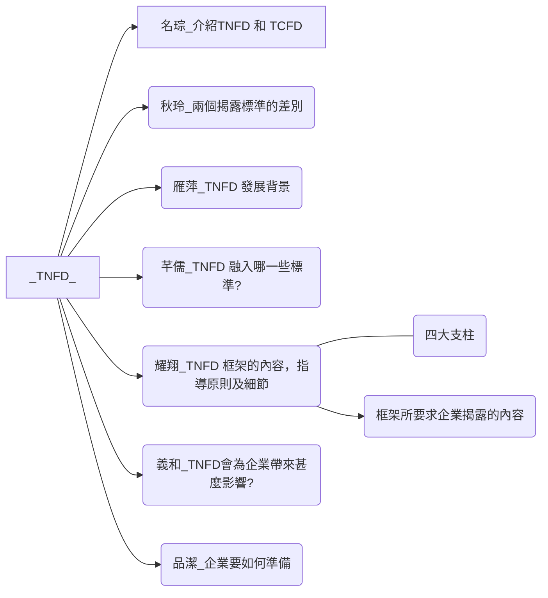

# [什麼是TNFD？](https://csr.cw.com.tw/article/43146)  

:::info PPTX編輯連結
https://liveyuntechedu-my.sharepoint.com/:p:/g/personal/b11123021_live_yuntech_edu_tw/EebDYde56-BHnqLgEqvf-EUBZQ2npPD0RTGiFoL7PAJkeQ?e=FOEMzN
:::

:::tip 其他參考資料，及報告要求
[**我存的參考資料**](https://bridgerhung.notion.site/f1ad6b2a3feb42e88bab918b0e932016)

[**TNFD官方網站**](https://framework.tnfd.global/dashboard/)  

[**官方0.4版最新文件公告 - 簡體中文**](https://framework.tnfd.global/wp-content/uploads/2023/03/23-23882-TNFD_v0.4_Short_Summary-ZH.pdf)  
:::

