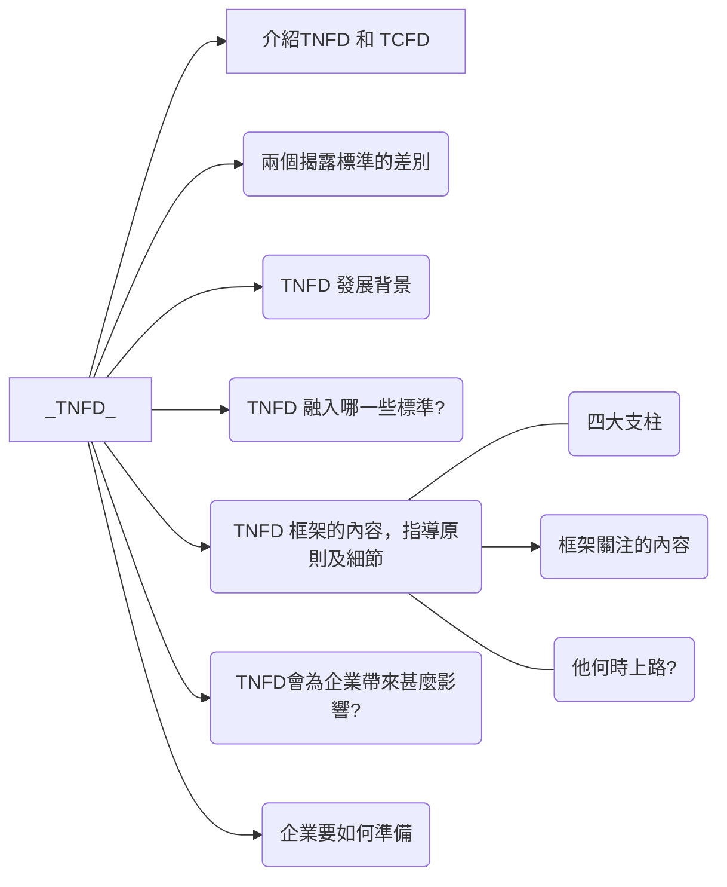

# [什麼是TNFD？](https://csr.cw.com.tw/article/43146)  

:::info PPTX編輯連結
https://liveyuntechedu-my.sharepoint.com/:p:/g/personal/b11123021_live_yuntech_edu_tw/EebDYde56-BHnqLgEqvf-EUBZQ2npPD0RTGiFoL7PAJkeQ?e=FOEMzN
:::

負責1的會再做