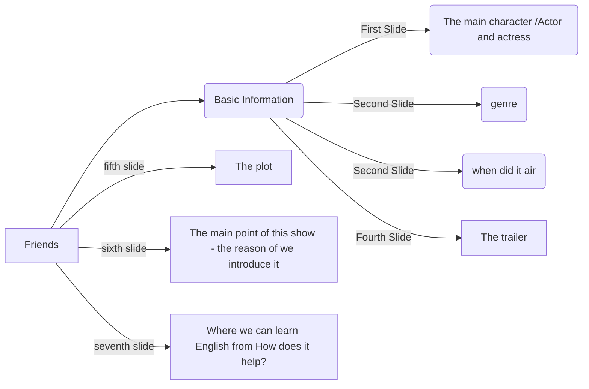

# 六人行

:::caution notice
**4/11 oral presentation**
:::

:::info PPTX 網址
[點我開啟PPTX網址](https://liveyuntechedu-my.sharepoint.com/:p:/g/personal/b11123021_live_yuntech_edu_tw/EQRQSPJdC45Dh7TWLFXCR08B5-dARA1yMW_NiojMpywFDw?e=qZKdQ6)  
  
[**教學**-如何使用電腦版office共同編輯?](https://brid.gq/共編)   
:::

:::tip 六人行相關資料
[豆瓣](https://movie.douban.com/subject/1393859/)  
[wiki](https://zh.wikipedia.org/zh-tw/%E8%80%81%E5%8F%8B%E8%AE%B0)
:::

Please prepare a 5-7mins presentation
Your presentation content should include:  
1.  Briefly introduce the TV Show  
- Ex: name, genre, when did it air…etc.  
2.  Introduce the cast  
- Ex: main actors/actresses

- Play a short trailer
3.  Explain why your group want to introduce this TV show
4.  Tell us what we can learn from the TV show? How does that help our English learning?

<iframe
  src="https://liveyuntechedu-my.sharepoint.com/personal/b11123021_live_yuntech_edu_tw/_layouts/15/Doc.aspx?sourcedoc={f2485004-0b5d-438e-87b4-d62c55c2474f}&action=embedview&wdAr=1.7777777777777777"
  width="100%"
  height="500px"
  frameBorder={0}
>
  這是 &lt;a target="_blank"
  href="https://office.com/webapps"&gt;Office&lt;/a&gt; 提供的內嵌 &lt;a
  target="_blank" href="https://office.com"&gt;Microsoft Office&lt;/a&gt; 簡報。
</iframe>

