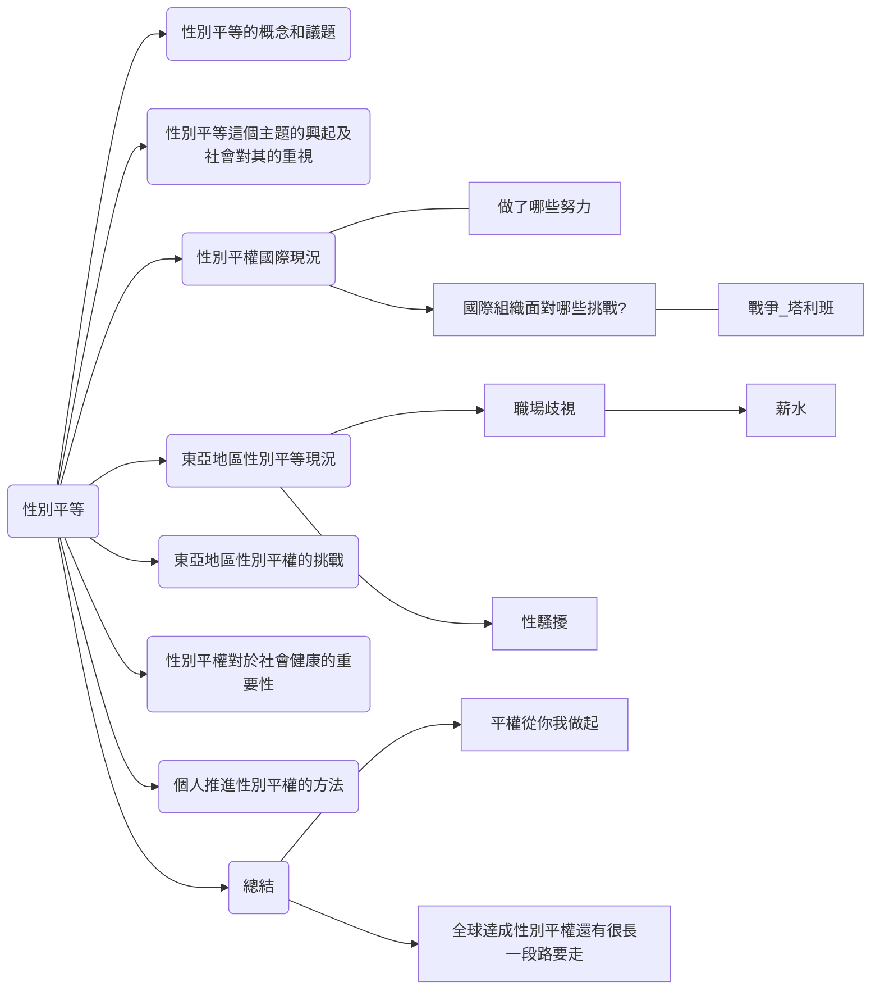

# Gender Equality 性別平權 

性別平權內容綱要

:::info GPT討論室
https://sharegpt.com/c/dgK0kaL
:::

:::warning PPTX編輯連結
https://liveyuntechedu-my.sharepoint.com/:p:/g/personal/b11123021_live_yuntech_edu_tw/EUm8lSWU1xVBv4YLGSCR7OMBI7UmuPnBC-oSiNFNd6Fbrg?e=f1e2JB  
:::

