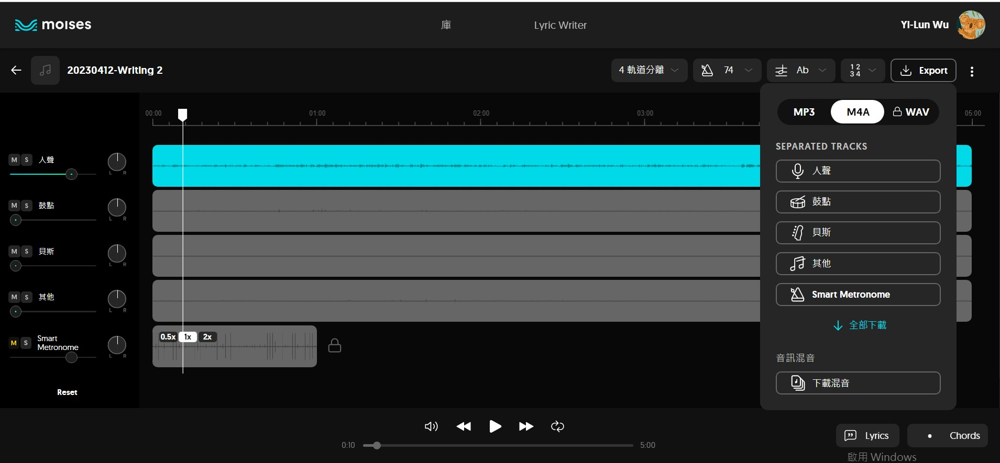

## 文字轉語音
### [Microsoft Azure 雲端文字轉語音](https://speech.microsoft.com/portal)  
**他是目前市面上最成熟的解決方案**
::::warning 提醒
***請使用雲科大帳號登入，有100美金額度***  
[**點擊我去啟用**](https://azure.microsoft.com/zh-tw/free/students/)

[**服務介紹影片**](https://youtu.be/yLmOCUEj0Og)  

[**現成版**](https://www.text-to-speech.cn/)
:::tip 
有台灣人的口音
:::

::::

#### 其他
https://ondoku3.com/zh-hans/  
https://notevibes.com/  
https://uberduck.ai/  
https://www.xaudiopro.com/aivoice/  

### 自建AI模型，模仿聲音進行配音
https://www.descript.com/overdub  
  
  
## 語音轉文字
> 下面兩個準確度都很高  

### [本地語音轉文字 OpenAI 模型](https://www.freedidi.com/8737.html)
:::warning 要有一張顯卡，才會比較快
:::  
### [線上語音轉文字 Mygoodtape](https://www.mygoodtape.com/)  

:::tip 我超愛用，限制不多
我都用它來產生字幕  
和上面的工具用一樣的模型  
:::

## AI 音訊處理

[**讓你的音效像專業podcast - adobe**](https://podcast.adobe.com/)  
:::warning 限制
在室內安靜的地方，使用手機錄音，效果會最好  
**在外面錄影的效果，降躁能力會比較普通**
:::

### [音訊降躁工具 -- 分離人聲](https://vocalremover.org/)  

[flexclip 具有音訊降躁功能，線上剪輯](https://www.flexclip.com/tw/editor/app?ratio=landscape)  

## AI 音樂創作
[Avia](https://aiva.ai/)  
> 每月三次，每次3分鐘

[音訊素材庫](https://evokemusic.ai/music)  

