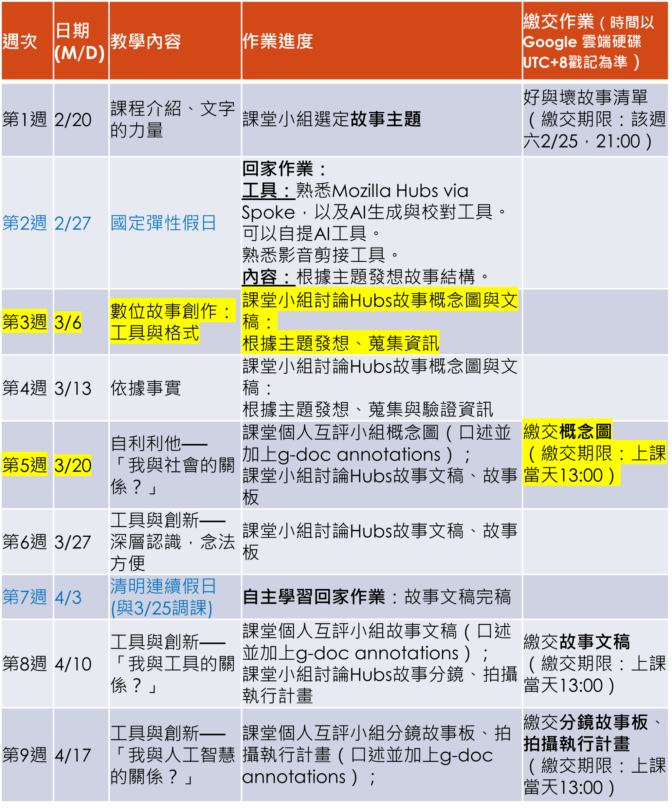
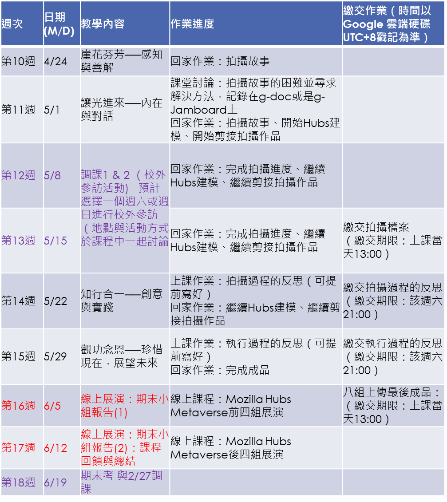

## 目前問題
:::caution 問題
## 連假作業
**我們要甚麼故事主題**  
**發想故事架構**
  
[**LINK_有這些主題**](/class/wen/reg#%E4%B8%BB%E9%A1%8C%E9%81%B8%E6%93%87)
:::

## 所需要使用的工具
:::tip 提示
[**點我前往**](/class/wen/Hubs)
:::

## 繳交日期
:::warning 繳交作業日期
**3/20 日繳交故事概念圖**
:::

| 日期 | 分組繳交作業 |
| :-----| ----: |
| 3/20 | 繳交概念圖 |
| 4/10 | 繳交故事文稿 |
| 4/17 | 分鏡故事板、拍攝執行計畫 |
| 5/15 | 繳交拍攝檔案 |
| 5/22 | 繳交拍攝過程反思 |
| 5/29 | 繳交執行過程反思 |
| 6/5 | 上傳最後成品 |

  

