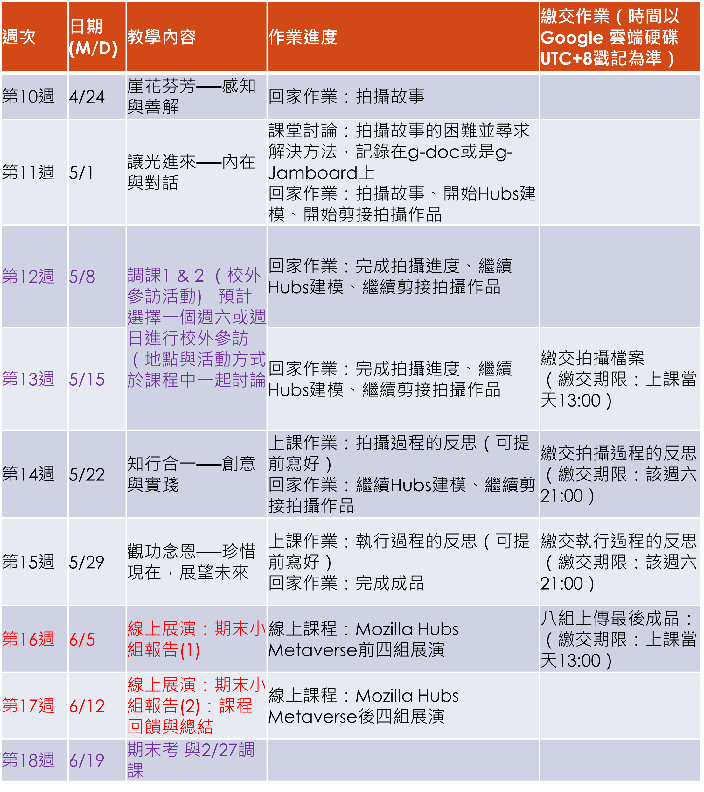
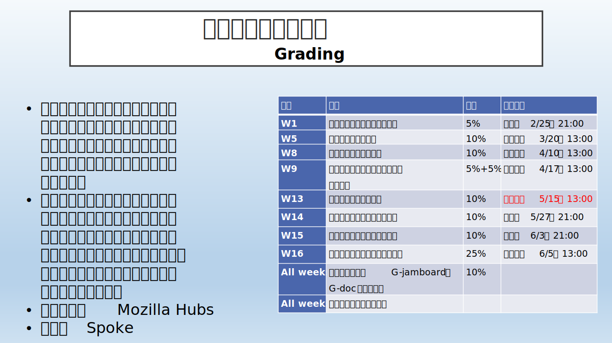
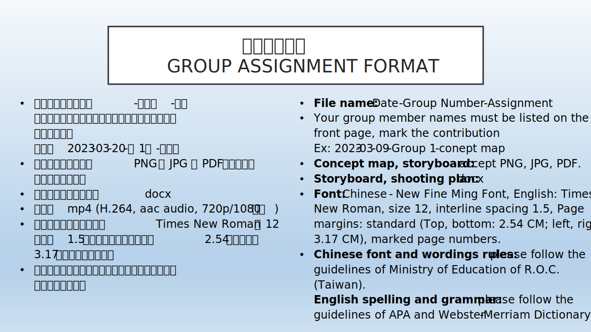

## notice
:::caution 

[**安然無恙**](./Story/Love_story)  
[**故事流程板**](./Story/storyboard)  
:::

## 所需要使用的工具
:::tip 提示
[**點我前往**](/class/wen/Hubs)
:::

| 日期 | 分組繳交作業 |
| :-----| ----: |
| 5/22 | 繳交拍攝過程反思 |
| 5/29 | 繳交執行過程反思 |
| 6/5 | 上傳最後成品 |

 

## 計分方式

### 小組

### 個人

