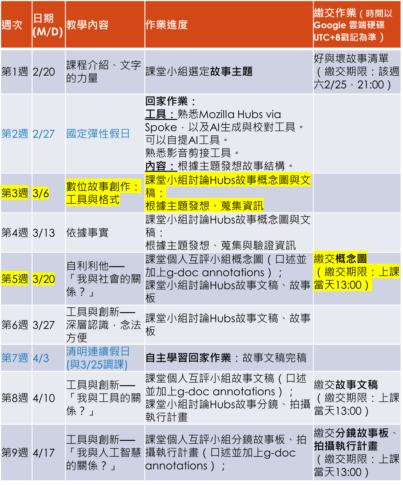
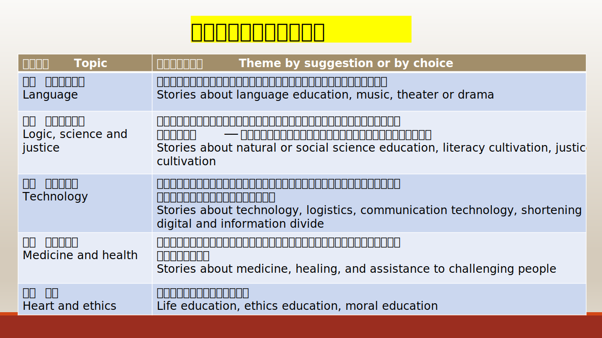
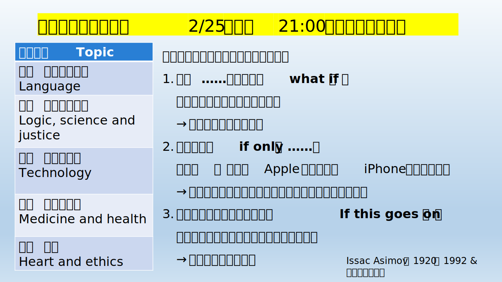

## notice
:::caution 提醒： **3/20 日上台報告**    

[**安然無恙**](./Story/Love_story_V1)  
[**故事流程板**](./Story/board)  

:::

:::note 報告
小組報告時，全組都要一起上台，事先分派好流程圖如何發想的過程，以及為什麼選擇該主題。  
預定為三至五分鐘，4:30會按鈴提示。  
老師會在課堂上事先提供並講解評分內容，每組同學都報告後，都會留一倒兩分鐘給同學寫互評單，上課時會詳細說明該部分。  
下週互評的部分緊扣「自利利他 我與社會的關係」這個主題的其中一部分。希望同學能夠利用上課時間好好學習，不要遲到。  
:::

## 所需要使用的工具
:::tip 提示
[**點我前往**](/class/wen/Hubs)
:::

| 日期 | 分組繳交作業 |
| :-----| ----: |
| 3/20 | 繳交概念圖 |
| 4/10 | 繳交故事文稿 |
| 4/17 | 分鏡故事板、拍攝執行計畫 |
| 5/15 | 繳交拍攝檔案 |
| 5/22 | 繳交拍攝過程反思 |
| 5/29 | 繳交執行過程反思 |
| 6/5 | 上傳最後成品 |

  

## 課程安排

## 主題選擇

## 計分方式

### 小組

### 個人

