:::info
[簡報連結](https://pan.brid.cf/d/Microsoft/yuntech/%E5%AD%B8%E7%BF%92%E6%AD%B7%E7%A8%8B%E6%AA%94%E6%A1%88.pptx)  
[聯絡方式 s811146@stu.chsc.tw](mailto:s811146@stu.chsc.tw)
:::
## 參考圖片

## 範例連結
### [我的二階備審檔案](https://drive.google.com/drive/folders/1cnre4JeC6HcrnEakJeUjdfBD1hcO5tva?usp=sharing)  
### [jcshawn 的備審製作教學](https://jcshawn.com/university-application-documents/)
#### [他的備審檔案](/政大資科學習歷程自述lucker公開版.pdf)
### [北科某位學長的備審](/Appdoc-blur-downscaled.pdf)
