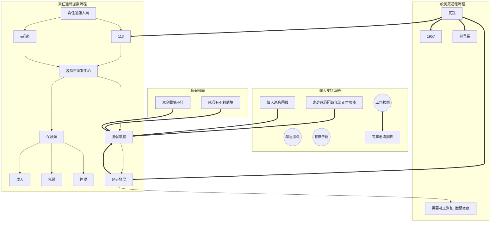

家庭中心
===

```mermaid
flowchart TD

    subgraph 個人支持系統
    XX((鄰里關係))
    EE((原生家庭))
    GG((有無子嗣))
    NN((工作狀態)) ==> 同事老闆關係
    AA((其他社會支持系統))
    end

    subgraph  責任通報派案流程
    A[責任通報人員] --> B[113]
    A --> C[e起來] 
    B  ---> D[各縣市派案中心] 
    C ---> D
    D ---> E[保護類]
    E ---> 成人
    E ---> 兒保
    E ---> 性侵
    D ---> F[脆弱家庭]
    F ---> DD{社福中心} 
    end

    subgraph 一般民眾通報流程 
    id1[民眾] ==> B[113]
    id1 ==> 1957
    id1 ==> 村里長
    id1 ==> DD{社福中心} --> 需要社工幫忙_脆弱家庭
    end
   
    subgraph  脆弱家庭
    AA[家庭成員因故無法正常功能]==>F[脆弱家庭]
    BB[成員有不利處境]==>F
    CC[家庭關係不佳]==>F
    DD[兒少發展]==>F
    EE[個人適應困難]==>F
    end
```
  